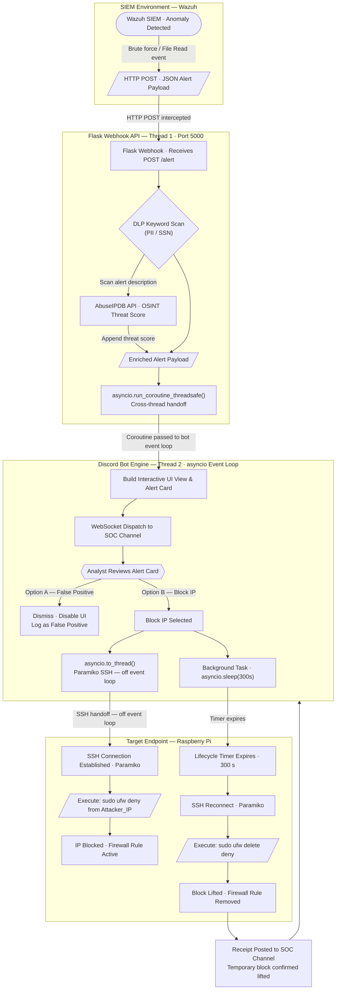

# Argus

Argus is a Python-based Discord ChatOps engine for security operations. It runs a Discord bot that receives SIEM webhook events, enriches threat data, and presents interactive incident response controls through Discord message components.

## What it does

- Listens for SIEM webhook POSTs at `/webhook` on port `5000`
- Parses incoming alert payloads and builds Discord embeds
- Enriches attacker IP data using AbuseIPDB when configured
- Loads Discord extension modules from `cogs/`
- Provides interactive buttons to block or dismiss alerts
- Uses SSH to orchestrate firewall actions on a target host via `ufw`
- Includes a scheduled threat intelligence extension that posts RSS feed summaries to Discord

## Installation

1. Create and activate a virtual environment

```powershell
python -m venv venv
.\venv\Scripts\Activate.ps1
```

2. Install dependencies

```powershell
python -m pip install -r requirements.txt
```

3. Create a `.env` file in the project root and set required variables

## Required environment variables

- `DISCORD_BOT_TOKEN`
- `DISCORD_GENERAL_CHANNEL_ID`
- `DISCORD_THREAT_INTEL_CHANNEL_ID`
- `PWNEDBYJT_DISCORD_USER_ID`
- `PI_IP`
- `PI_USER`

## Optional environment variables

- `ABUSEIPDB_API_KEY` — enables external IP reputation lookups
- `BAN_DURATION_SECONDS` — temporary block duration, default `300`

## Run

```powershell
python argus.py
```

The bot starts Discord connection and launches the Flask webhook listener alongside it.

## Webhook interface

- Endpoint: `POST /webhook`
- Port: `5000`
- Payload: JSON containing a `rule` object and `data.srcip`

The webhook server accepts either a direct payload or a nested `all_fields` object and forwards processed alerts to the configured Discord channel.

## Notes

- The bot uses `discord.py` and Flask
- `cogs/threat_intel.py` implements a daily RSS feed collector for threat intelligence posts
- The bot dynamically loads all Python files in `cogs/` at startup

## Architecture

- The alert processing flow chart is available in `cogs/flowChart.mmd`
- The diagram covers:
  - Wazuh SIEM alert ingestion
  - Flask webhook enrichment and threat scoring
  - Discord alert card dispatch and analyst interaction
  - Paramiko SSH firewall enforcement and automatic unblock lifecycle

## Flow chart


